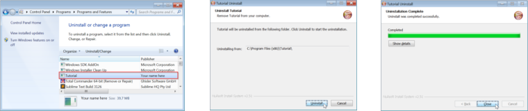
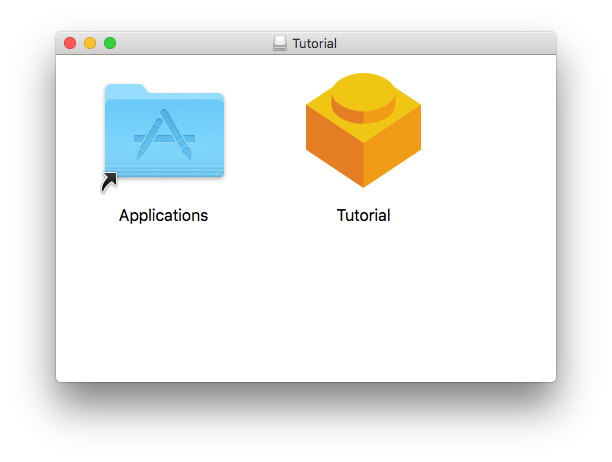

# fbs tutorial
This tutorial is meant for Windows, Mac and Ubuntu. You need Python 3.5.
(Higher versions may work as well, but are not officially supported.)

Clone this repository and `cd` into it:

    git clone https://github.com/mherrmann/fbs-tutorial
    cd fbs-tutorial

Create a virtual environment:

    python3 -m venv venv

Activate the virtual environment:

    # On Mac/Linux:
    source venv/bin/activate
    # On Windows:
    call venv\scripts\activate.bat

Install the required libraries (most notably, `fbs` and `PyQt5`):

    pip install -r requirements.txt

Run the sample app:

    python -m fbs run

This shows a (admittedly not very exciting) window:


To compile the app to a standalone executable:

    python -m fbs freeze

This produces the folder `target/Tutorial`. You can copy this folder to any
other computer (with the same OS as yours) and run your app there! Isn't that
awesome?

## The source code
The source code for the above app is in
[`src/main/python`](src/main/python/tutorial). It contains a
[`main.py` script](src/main/python/tutorial/main.py), which serves as the entry
point for the application:

```python
from tutorial.application_context import AppContext

import sys

if __name__ == '__main__':
    appctxt = AppContext()
    exit_code = appctxt.run()
    sys.exit(exit_code)
```

The script instantiates and then runs an _application context_. This is defined
in [`application_context.py`](src/main/python/tutorial/application_context.py):

```python
from fbs_runtime.application_context import ApplicationContext, \
    cached_property
from PyQt5.QtWidgets import QApplication, QMainWindow

class AppContext(ApplicationContext):
    def run(self):
        self.main_window.show()
        return self.app.exec_()
    @cached_property
    def main_window(self):
        result = QMainWindow()
        result.setWindowTitle('Hello World!')
        result.resize(250, 150)
        return result
```

Your apps should follow the same structure:

 * Create a subclass of `fbs_runtime.application_context.ApplicationContext`.
 * Define a `run()` method that ends with `return self.app.exec_()`.
 * Use `@cached_property` to define the objects of your app.
 * In your `main` script, instantiate the application context, invoke its
   `run()` method and pass the return value to `sys.exit(...)`.

This  may seem complicated at first. But it has several advantages: First, it
lets `fbs` define useful default behaviour (such as setting the
[app icon](src/main/icons) or letting you access resource files bundled with
your app). Also, as your application becomes more complex, you will find that
an application context is extremely useful for "wiring together" the various
Python objects that make up your app. The next section demonstrates both of
these advantages.

## A more complicated example
Take a look at
[`application_context_2.py`](src/main/python/tutorial/application_context_2.py).
It defines a new `@cached_property`:

```python
class AppContext(ApplicationContext):
    ...
    @cached_property
    def image(self):
        return QPixmap(self.get_resource('success.jpg'))
```

A `@cached_property` is simply a Python `@property` whose value is cached.
Here's how it is used:

```python
class AppContext(ApplicationContext):
    ...
    @cached_property
    def main_window(self):
        ...
        image_container.setPixmap(self.image)
```

The first time `self.image` is accessed, the `return QPixmap(...)` code from 
above is executed. After that, the value is cached and returned without
executing the code again.

`@cached_property` is extremely useful for instantiating and connecting the
Python objects that make up your application. For each component, define a
`@cached_property`. If it requires other objects, simply access them as
properties, like `self.image` above. The fact that all parts of your application
live in one place (the application context) makes it extremely easy to manage
them and see what is used where.

To see the new example in action, change the line

```python
from tutorial.application_context import AppContext
```

in your copy of [`main.py`](src/main/python/tutorial/main.py) to

```python
from tutorial.application_context_2 import AppContext
```

Then, run `python -m fbs run` again. You will be rewarded ;-)

### Resources
Another feature of our new example was the call
`self.get_resource('success.jpg')`. It loads an image that lives in the folder
[`src/main/resources`](src/main/resources/base).
But what if the user is running the compiled form of your app? In that case,
there is no `src/...`, because the directory structure is completely different.

The answer is that `get_resource(...)` is clever enough to determine whether it
is running from source, or from the compiled form of your app. To ensure that
the image is in fact distributed alongside your application, `fbs` copies all
files from `src/main/resources` into the `target/Tutorial` folder. So, if you
have data files that you want to include (such as images, `.qss` style sheets -
Qt's equivalent of `.css` files - etc.) place them in `src/main/resources`.

### Different OSs
Often, you will want to use different versions of a resource file depending on
the operating system. A typical example of this are `.qss` files where you
modify your app's style to match the current OS.

The solution for this is that `get_resource(...)` first looks for a
platform-specific version of the given file. Depending on the current OS, it
searches the following locations:

 * `src/main/resources/windows`
 * `src/main/resources/mac`
 * `src/main/resources/linux`

If it can't find the file in any of these folders, it falls back to
`src/main/resources/base`.

## Creating an installer
To distribute your app to your users, you need an installer. On Windows, this
is a `MyAppSetup.exe` file. On Mac, it's `MyApp.dmg`. fbs lets you generate both
of these files with the command `python -m fbs installer`.

### Windows installer
To create an installer on Windows, you first need to install
[NSIS](http://nsis.sourceforge.net/Main_Page). Then, please add NSIS'
installation directory to your `PATH` environment variable.

Once you have completed the above steps, run `python -m fbs installer`. This
creates an installer at `target/TutorialSetup.exe`. It has the following
features:

 * It lets your users pick the installation directory.
 * It creates an entry for your app in the Start Menu.
 * It adds your app to the list of installed programs. The user can uninstall your app from there.

The following two screenshots show this:




### Mac installer
To create an installer on Mac, run `python -m fbs installer`. This creates the
file `target/Tutorial.dmg`, which can be used to install the app. When your
users open it, it looks as follows:



To install your app, your users simply drag it into the _Applications_ folder
also displayed in the screenshot.

## Up next...
As of Dec 20, 2017, this tutorial is a work in progress. Still to come:

 * Creating an installer for your app
 * Codesigning so your users don't get ugly "app is untrusted" messages
 * Automatic updates

Feel free to share the link to this tutorial! If you are not yet on fbs's
mailing list and want to be notified when the tutorial is expanded,
[sign up here](http://eepurl.com/ddgpnf).