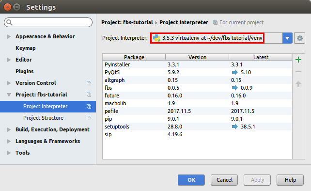
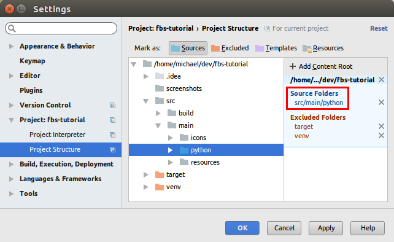
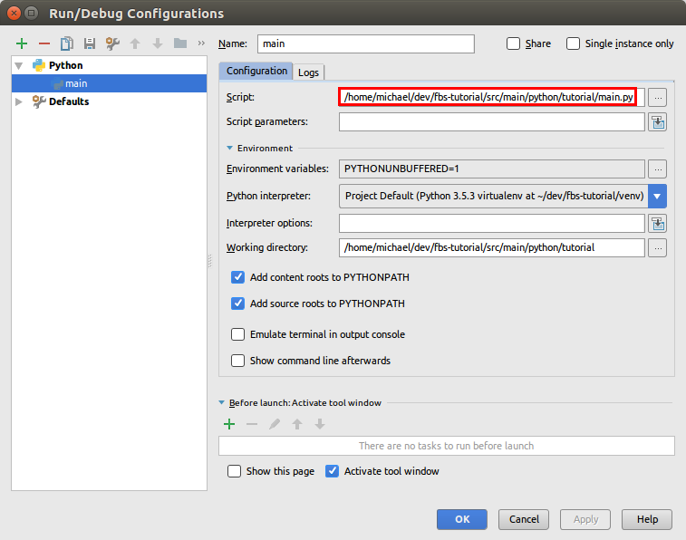

# fbs tutorial
This tutorial is meant for Windows, Mac and Ubuntu. You need
[Python 3.5](https://www.python.org/downloads/release/python-354/).
(Later versions have known issues and are not yet supported.)

## Setup
[Download](https://github.com/mherrmann/fbs-tutorial/archive/master.zip)
the Zip file of this repository and extract it. Then, open a command prompt
and `cd` into it:

    cd .../path/to/fbs-tutorial-master

Create a virtual environment:

    python3 -m venv venv

Activate the virtual environment:

    # On Mac/Linux:
    source venv/bin/activate
    # On Windows:
    call venv\scripts\activate.bat

The remainder of the tutorial assumes that the virtual environment is active.

Install the required libraries (most notably, `fbs` and `PyQt5`):

    pip install -r requirements.txt

## Run the app
This repository contains a sample application. To run it from source, execute
the following command:

    python -m fbs run

This shows a (admittedly not very exciting) window. Screenshots on
Windows/Mac/Ubuntu:

  

## Freezing your app
We want to turn the source code of your app into a standalone executable that
can be run on your users' computers. In the context of Python applications, this
process is called "freezing".

Use the following command to turn your app's source code into a standalone
executable:

    python -m fbs freeze

This creates the folder `target/Tutorial`. You can copy this directory to any
other computer (with the same OS as yours) and run your app there! Isn't that
awesome?

## Creating an installer
Desktop applications are normally distributed by means of an installer.
On Windows, this would be an executable called `TutorialSetup.exe`.
On Mac, mountable disk images such as `Tutorial.dmg` are commonly used.
fbs lets you generate both of these files.

### Windows installer
To create an installer on Windows, please first install
[NSIS](http://nsis.sourceforge.net/Main_Page) and add its directory to your
`PATH` environment variable. Then, you can run the following command:

    python -m fbs installer

This creates an installer at `target/TutorialSetup.exe`. It lets your users pick
the installation directory and adds your app to the Start Menu. It also creates
an entry in Windows' list of installed programs. Your users can use this to
uninstall your app. The following screenshots show these steps in action.

   

  

### Mac installer
Creating an installer on Mac is done with the same command as on Windows:

    python -m fbs installer

This creates the file `target/Tutorial.dmg` for distribution to your users.
Upon opening it, the following volume is displayed:


To install your app, your users simply drag its icon to the _Applications_
folder (also shown in the volume).

## Source code of the sample app
Let's now take a look at the source code for the sample application. It is at
[`src/main/python/main.py`](src/main/python/main.py):

```python
from fbs_runtime.application_context import ApplicationContext
from PyQt5.QtWidgets import QMainWindow

import sys

class AppContext(ApplicationContext):           # 1. Subclass ApplicationContext
    def run(self):                              # 2. Implement run()
        window = QMainWindow()
        window.setWindowTitle('Hello World!')
        window.resize(250, 150)
        window.show()
        return self.app.exec_()                 # 3. End run() with this line

if __name__ == '__main__':
    appctxt = AppContext()                      # 4. Instantiate the subclass
    exit_code = appctxt.run()                   # 5. Invoke run()
    sys.exit(exit_code)
```

The important steps are highlighted as comments in the code. If they look
daunting to you, don't worry. They're all that's required. You can see in the
middle of the code that a window is being created, resized and then shown.

## A more complicated example
Take a look at
[`main_2.py`](src/main/python/main_2.py). It defines a `@cached_property`:

```python
class AppContext(ApplicationContext):
    ...
    @cached_property
    def image(self):
        return QPixmap(self.get_resource('success.jpg'))
```

You can use `@cached_property` to define the components that make up your app.
Here's how it is used:

```python
class AppContext(ApplicationContext):
    ...
    def main_window(self):
        ...
        image_container.setPixmap(self.image)
```

The way `@cached_property` works is that the first time `self.image` is
accessed, `return QPixmap(...)` is executed. After that, the value is cached and
returned without executing the code again.

This is extremely useful for instantiating and connecting the Python objects
that form your app. Define a `@cached_property` for each component (a window, a
database connection, etc.). If it requires other objects, access them as
properties, like `self.image` above. The fact that all parts of your application
live in one place (the application context) makes it extremely easy to manage
them and see what is used where.

To see the new example in action, change

```
"main_module": "src/main/python/main.py"
```

in your copy of [`base.json`](src/build/settings/base.json) to

```
"main_module": "src/main/python/main_2.py"
```

Then, run `python -m fbs run` again. You will be rewarded ;-)

As a final note, it should be said that you don't have to use
`@cached_property`. It is merely recommended.

### Resources
Another feature of our new example was the call
`self.get_resource('success.jpg')`. It loads an image that lives in the folder
[`src/main/resources`](src/main/resources/base).
But what if the user is running the compiled form of your app? In that case,
there is no `src/...`, because the directory structure is completely different.

The answer is that `get_resource(...)` is clever enough to determine whether it
is running from source, or from the compiled form of your app. To ensure that
the image is in fact distributed alongside your application, `fbs` copies all
files from `src/main/resources` into the `target/Tutorial` folder. So, if you
have data files that you want to include (such as images, `.qss` style sheets -
Qt's equivalent of `.css` files - etc.) place them in `src/main/resources`.

### Different OSs
Often, you will want to use different versions of a resource file depending on
the operating system. A typical example of this are `.qss` files where you
modify your app's style to match the current OS.

The solution for this is that `get_resource(...)` first looks for a
platform-specific version of the given file. Depending on the current OS, it
searches the following locations:

 * `src/main/resources/windows`
 * `src/main/resources/mac`
 * `src/main/resources/linux`

If it can't find the file in any of these folders, it falls back to
`src/main/resources/base`.

## Using an IDE
The command `python -m fbs run` is great for quick results. Many people however
prefer working in an IDE such as [PyCharm](https://www.jetbrains.com/pycharm/).
It especially simplifies debugging.

To run the sample app from other environments (such as an IDE), you simply

 * need the virtual environment to be active,
 * have `src/main/python` on your `PYTHONPATH` and
 * run `src/main/python/main.py`.

So for example on Mac and Linux, you can also run the app via

    PYTHONPATH=src/main/python python src/main/python/main.py

(assuming the virtual environment is active).

Here are screenshots of how PyCharm can be configured to run your app:

  

## Dependencies
At some point during the development of your application, you will most likely
want to include other libraries. Doing this with fbs is very simple: Just
install the library with `pip` and use it in your code. fbs automatically
packages it with your app when you run `python -m fbs freeze`. (This is achieved
with [PyInstaller](http://www.pyinstaller.org/), which fman uses under the
hood).

## Up next...
As of September 2018, this tutorial is a work in progress. Still to come:

 * Creating an installer for Ubuntu (Linux)
 * Code signing so your users don't get ugly "app is untrusted" messages
 * Automatic updates

Feel free to share the link to this tutorial! If you are not yet on fbs's
mailing list and want to be notified when the tutorial is expanded,
[sign up here](https://emailoctopus.com/lists/5061ca0f-33e0-11e8-a3c9-06b79b628af2/forms/subscribe).
