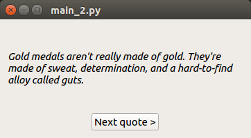
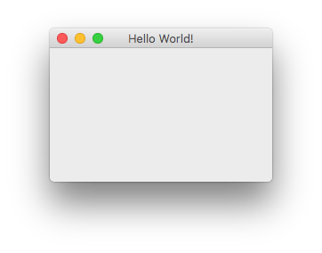
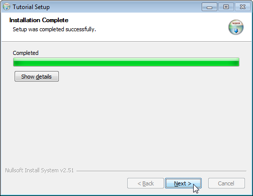
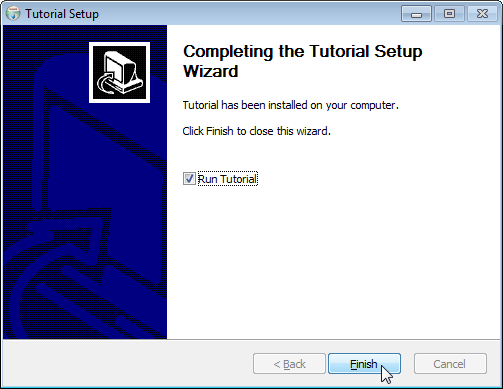
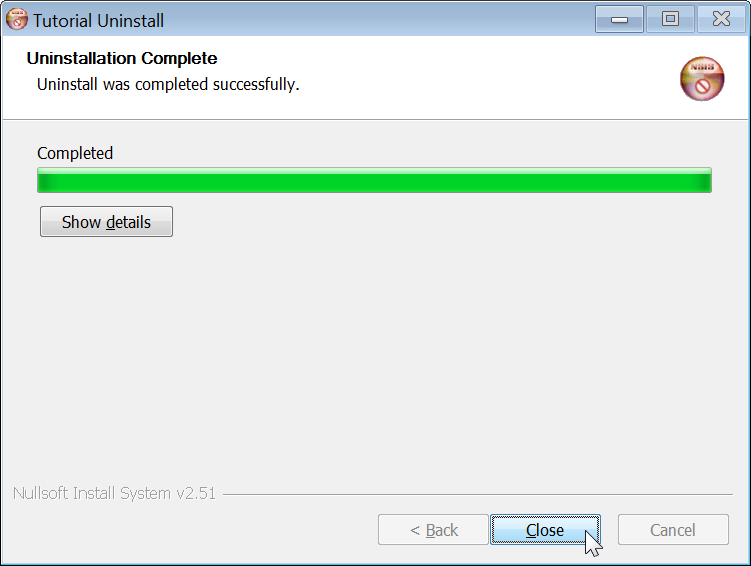

# fbs tutorial
This tutorial shows how you can use fbs to create a simple Python GUI and an
associated installer:

  
 
You can follow this tutorial on Windows, Mac or Linux. You need Python 3.5 or
later.

## Setup
Create a virtual environment in the current directory:

    python3 -m venv venv

Activate the virtual environment:

    # On Mac/Linux:
    source venv/bin/activate
    # On Windows:
    call venv\scripts\activate.bat

The remainder of the tutorial assumes that the virtual environment is active.

Install the required libraries (most notably, `fbs`):

    pip install fbs-tutorial

(If this produces errors, try `pip install wheel` first.)

We are using PyQt in this tutorial. In other fbs projects, you can use PySide
just as well.

## Start a project
Execute the following command to start a new fbs project:

    fbs startproject

The command creates a new folder called `src/` in your current directory.
This folder contains the minimum configuration for a bare-bones Python/Qt app.

## Run the app
To run ourl little application from source, execute the following command:

    fbs run

This shows a (admittedly not very exciting) window. Screenshots on
Windows/Mac/Ubuntu:

  

## Source code of the sample app
Let us now take a look at the source code that was generated by fbs. It is at
[`src/main/python/main.py`](https://github.com/mherrmann/fbs/blob/master/fbs/builtin_commands/project_template/src/main/python/main.py):

```python
from fbs_runtime.application_context.PyQt5 import ApplicationContext
from PyQt5.QtWidgets import QMainWindow

import sys

if __name__ == '__main__':
    appctxt = ApplicationContext()       # 1. Instantiate ApplicationContext
    window = QMainWindow()
    window.resize(250, 150)
    window.show()
    exit_code = appctxt.app.exec()      # 2. Invoke appctxt.app.exec()
    sys.exit(exit_code)
```

The important steps are highlighted as comments. They're the only boilerplate
that's required. In the middle of the code, you can see that a window is being
created, resized and then shown.

## Freezing the app
We want to turn the source code of our app into a standalone executable that can
be run on your users' computers. In the context of Python applications, this
process is called "freezing".

Use the following command to turn the app's source code into a standalone
executable:

    fbs freeze

This creates the folder `target/Tutorial`. You can copy this directory to any
other computer (with the same OS as yours) and run the app there! Isn't that
awesome?

## Creating an installer
Desktop applications are normally distributed by means of an installer.
On Windows, this would be an executable called `TutorialSetup.exe`.
On Mac, mountable disk images such as `Tutorial.dmg` are commonly used.
On Linux, `.deb` files are common on Ubuntu, `.rpm` on Fedora / CentOS, and
`.pkg.tar.xz` on Arch.

fbs lets you generate each of the above packages via the command:

    fbs installer

Depending on your operating system, this may require you to first install some
tools. Please read on for OS-specific instructions.

### Windows installer
Before you can use the `installer` command on Windows, please install
[NSIS](http://nsis.sourceforge.net/Main_Page) and add its installation directory
to your `PATH` environment variable.

The installer is created at `target/YourAppSetup.exe`. It lets your users pick
the installation directory and adds your app to the Start Menu. It also creates
an entry in Windows' list of installed programs. Your users can use this to
uninstall your app. The following screenshots show these steps in action:

   

  

### Mac installer
On Mac, the `installer` command generates the file `target/YourApp.dmg`. When
your users open it, they see the following volume:


To install your app, your users simply drag its icon to the _Applications_
folder (also shown in the volume).

### Linux installer
On Linux, the `installer` command requires that you have
[fpm](https://github.com/jordansissel/fpm). You can for instance follow
[these instructions](https://fpm.readthedocs.io/en/latest/installation.html) to
install it.

Depending on your Linux distribution, fbs creates the installer at 
`target/YourApp.deb`, `...pkg.tar.xz` or `...rpm`. Your users can use these
files to install your app with their respective package manager.

## A more interesting example
We will now create a more powerful example. Here's what it looks like on
Windows:


When you click on the button in the window, a new quote is fetched from the
internet and displayed above.

Before you can run this example, you need to install the Python
[requests](http://docs.python-requests.org/en/master/) library. To do this,
type in the following command:

    pip install requests

The source code of the new app consists of two files:
 * [`main.py`](https://raw.githubusercontent.com/mherrmann/fbs-tutorial/master/main.py)
 * [`styles.qss`](https://raw.githubusercontent.com/mherrmann/fbs-tutorial/master/styles.qss)

Please copy the former over the existing file in `src/main/python/`, and the
latter into the _new_ directory `src/main/resources/base/`.

Once you have followed these steps, you can do `fbs run` (or `fbs freeze` etc.)
as before.

The new app uses the following code to fetch quotes from the internet:

```python
def _get_quote():
    return requests.get('https://build-system.fman.io/quote').text
```

You can see that it uses the `requests` library we just installed above. Feel 
free to open
[build-system.fman.io/quote](https://build-system.fman.io/quote) in the
browser to get a feel for what it returns. Its data comes from a
[public database](https://github.com/bmc/fortunes).

The app follows the same basic steps as before. It instantiates an application
context and ends by calling `appctxt.app.exec_()`:

```python
appctxt = ApplicationContext()
...
exit_code = appctxt.app.exec_()
sys.exit(exit_code)
```

What's different is what happens in between:

```python
stylesheet = appctxt.get_resource('styles.qss')
appctxt.app.setStyleSheet(open(stylesheet).read())
window = MainWindow()
window.show()
```

The first line uses
[`get_resource(...)`](https://build-system.fman.io/manual/#get_resource) to
obtain the path to [`styles.qss`](styles.qss). This is a QSS file, Qt's
equivalent to CSS. The next line reads its contents and sets them as the
stylesheet of the application context's `.app`.

fbs ensures that `get_resource(...)` works both when running from source (i.e.
during `fbs run`) and when running the compiled form of your app. In the former
case, the returned path is in `src/main/resources`. In the latter, it will be in
your app's installation directory. fbs handles the corresponding details
transparently.

The next-to-last line instantiates `MainWindow`. This new class sets up the text
field for the quote and the button. When the button is clicked, it changes the
contents of the text field using `_get_quote()` above. You can find the
full code in [`main.py`](main.py).

As already mentioned, you can use `fbs run` to run the new app. But here's
what's really cool: You can also do `fbs freeze` and `fbs installer` to
distribute it to other computers. fbs includes the `requests` dependency and the
`styles.qss` file automatically.

## Summary
fbs lets you use Python and Qt to create desktop applications for Windows, Mac
and Linux. It can create installers for your app, and automatically handles the
packaging of third-party libraries and data files. These things normally take
weeks to figure out. fbs gives them to you in minutes instead.

## Where to go from here
fbs's [Manual](https://build-system.fman.io/manual/) explains the technical
foundation of the steps in this tutorial. Read it to find out more about fbs's
required directory structure, dependency management, handling of data files,
custom build commands, API and more.

If you have not used PyQt before: It's the library that allowed us in the above
examples to use Qt (a GUI framework) from Python. fbs's contribution is not to
combine Python and Qt. It's to make it very easy to package and deploy
Python and Qt-based apps to your users' computers. For an introduction to PyQt,
see [here](https://build-system.fman.io/pyqt5-tutorial).

Feel free to share the link to this tutorial!
